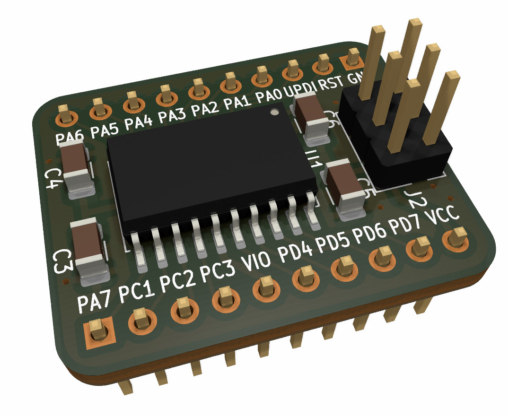

# AVR32DD20 Meson Toolchain and Breadboard Adapter PCB

[Meson-based](https://mesonbuild.com/) toolchain for the [Microchip AVR32DD20 MCU](https://www.microchip.com/en-us/product/AVR32DD20
) along with a simple breadboard adapter PCB.

<div align="center">

</div>

> **Warning**  
> This repository is mainly meant as a reference for myself; as such, it may not turn out to be very useful to you.

## Meson Toolchain

### Compile the test program

To compile the test program (see  [`src/main.c`](src/main.c)), follow the following steps.
1. Install `avrdude` and the `avr-gcc` toolchain, as well as `meson` build and `ninja`. On Fedora Linux, simply run
```sh
sudo dnf install avrdude avr-gcc avr-gcc-c++ avr-binutils ninja meson
```
1. Clone this repository
```sh
git clone https://github.com/astoeckel/avr32dd20_meson_toolchain_and_pcb
cd avr32dd20_meson_toolchain_and_pcb
```
1. Edit the `path` constant in `avr-unknown-gcc.txt` to point at your copy of the Git repository. Right now, `meson` does not support relative paths in the toolchain definition, so the absolute path has to be inserted by hand.
1. Create a build directory and compile:
```sh
mkdir build; cd build
meson setup --cross-file=../avr-unknown-gcc.txt ..
ninja
```

### Flash the test program

To flash the test program using `avrdude` and a `jtag2udpi`-compatible programmer (I'm using a [Diamex EXA-PROG](https://www.diamex.de/dxshop/EXA-PROG-AVR-ISP-und-UPDI-STM32-NXP-ESP)), simply run
```sh
ninja flash
```
Edit [`meson.build`](meson.build) to change the programmer parameters.

## PCB

The PCB is a simple adapter for putting AVR32DD20 in the SOIC20 onto a breadboard.
All KiCAD project files are located in the [board](board/kicad) folder; you can find the final Gerber files in the [gerber](board/gerber) folder.

### Features

* **UPDI programming header**  
  The PCB includes a standard 6-pin UPDI programming header. Note that no extra resistors or diodes are included; this board assumes that you have a proper UPDI programmer that includes all required circuitry.
* **Bypass capacitors**  
  There is some space on the PCB to place 10n and 100n bypass capacitors onto the VCC and VIO lines.

# License information

This repository contains code from various sources:

* `avrdude.conf`  
  This file has been adapted from the `jtag2updi` project (see https://github.com/ElTangas/jtag2updi); the file was extended to include the `avr32dd20`.
* `part_definition`  
  These files have been copied from the Microchip AVR-Dx Series Device Support pack. See https://packs.download.microchip.com/ for more information.
* `avr-unknown-gcc.txt`  
  This file has been adapted from Jussi Pakkanen's Meson Arduino Project: https://github.com/jpakkane/mesonarduino

Apart from these directories, and unless noted differently, the files in this repository are licensed as follows:

### Hardware schematics

    Copyright Andreas Stöckel 2022.
    
    This documentation describes Open Hardware and is licensed under the
    CERN OHL v. 1.2. You may redistribute and modify this documentation under
    the terms of the CERN OHL v.1.2. (http://ohwr.org/cernohl). This
    documentation is distributed WITHOUT ANY EXPRESS OR IMPLIED WARRANTY,
    INCLUDING OF MERCHANTABILITY, SATISFACTORY QUALITY AND FITNESS FOR A
    PARTICULAR PURPOSE. Please see the CERN OHL v.1.2 for applicable conditions.

### Software (AVR firmware and host programs)

    Copyright (c) 2022 Andreas Stöckel

    Permission is hereby granted, free of charge, to any person obtaining a copy
    of this software and associated documentation files (the "Software"), to deal
    in the Software without restriction, including without limitation the rights
    to use, copy, modify, merge, publish, distribute, sublicense, and/or sell
    copies of the Software, and to permit persons to whom the Software is
    furnished to do so, subject to the following conditions:

    The above copyright notice and this permission notice shall be included in all
    copies or substantial portions of the Software.

    THE SOFTWARE IS PROVIDED "AS IS", WITHOUT WARRANTY OF ANY KIND, EXPRESS OR
    IMPLIED, INCLUDING BUT NOT LIMITED TO THE WARRANTIES OF MERCHANTABILITY,
    FITNESS FOR A PARTICULAR PURPOSE AND NONINFRINGEMENT. IN NO EVENT SHALL THE
    AUTHORS OR COPYRIGHT HOLDERS BE LIABLE FOR ANY CLAIM, DAMAGES OR OTHER
    LIABILITY, WHETHER IN AN ACTION OF CONTRACT, TORT OR OTHERWISE, ARISING FROM,
    OUT OF OR IN CONNECTION WITH THE SOFTWARE OR THE USE OR OTHER DEALINGS IN THE
    SOFTWARE.

